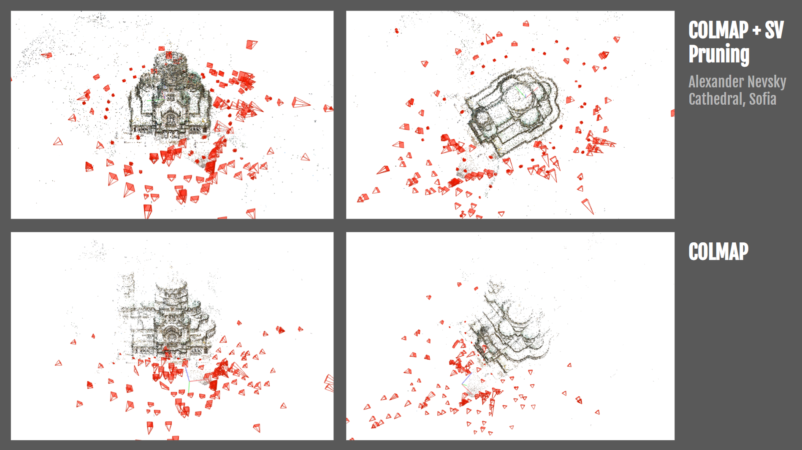

# i'm map?

Visualizer for the Google Maps Street View panorama dataset curated for [MegaScenes](https://megascenes.github.io/) text annotation evaluation. 

# _'s for the streets

Rendering of the Structure-from-Motion (SfM) pipeline that takes in multiview internet images of visually disambiguous scenes across the globe and outputs a dense, robust 3D reconstruction.

Given visually disambigous scenes, this pipeline curates a Google Maps Street View panorama dataset capturing the diverse facades of such scene from different camera viewing directions and locations. 

To prepare the curated Google Maps Street View panorama dataset for integration with COLMAP, run:

```
source activate maps_env

python prepare_colmap.py ${LOCATION} to_streetview

source deactivate

cp -r /share/phoenix/nfs06/S9/yx642/renamed_megascenes_images/${LOCATION}/images/* matches/wikimedia/${LOCATION}

cp -r matches/wikimedia/${LOCATION}/* matches/st_wiki_combined/${LOCATION}
cp -r matches/streetview/${LOCATION}/* matches/st_wiki_combined/${LOCATION}
```

As per the classical SfM pipeline, exhaustive matches between images of the combined Wikimedia Commons and Google Maps Street View panorama dataset are found using SIFT feature descriptor correspondences:

```
colmap feature_extractor \
    --database_path colmap_workspace/${LOCATION}/database.db \
    --image_path matches/st_wiki_combined/${LOCATION} \
    --SiftExtraction.use_gpu 1

colmap exhaustive_matcher \
    --database_path colmap_workspace/${LOCATION}/database.db \
    --SiftMatching.use_gpu 1
```

COLMAP's ```exhaustive_matcher``` results in a scene graph consisting of many incorrectly matched images that capture visually similar but distinct surfaces (aka, doppelgangers). The result of keeping these doppelganger matches when running COLMAP's ```mapper``` function is often a 3D reconstruction that contains collapsed structures and incorrect geometry.



In this pipeline, we prune edges containing doppelganger matches from the scene graph returned by ```exhaustive_matcher``` by having Google Gemini API act as a doppelganger filter. Each panorama in the Google Maps Street View dataset contains a ground truth heading, relative to true North. Given a scene, for every Wikimedia Commons image and its matches produced by ```exhaustive_matcher```, we have Gemini API return only the Google Maps Street View images that accurately depict the same facade captured by the Wikimedia Commons image. To provide an accurate heading, camera location, and camera viewing direction relative to the scene for each Wikimedia Commons image, Google Maps Street View images returned by Gemini API are constrained within some range of headings. 

The weighted average of headings, where number of feature matches from COLMAP act as weights, of the remaining Google Maps Street View images are used to give the corresponding Wikimedia Commons image a camera location, camera viewing direction, and GPS-based prior position. Finally, only other Wikimedia Commons images already matched by COLMAP and taken at approximately "nearby" camera location and viewing direction are kept as "true matches":

```
python get_matches.py ${LOCATION} filter_matches

python filter_doppelgangers.py ${LOCATION}

python prepare_colmap.py ${LOCATION} get_gps_prior

python get_matches.py ${LOCATION} prune_matches
```

After doppelganger and other incorrect matches are pruned, COLMAP's ```pose_prior_mapper``` is run on the remaining matches to produce a 3D reconstruction of the given scene. Then COLMAP's ```model_aligner``` using the GPS-based prior positions of the Wikimedia Commons and Google Maps Street View panorama dataset is run to scale the 3D reconstruction up to its real-world scale:

```
colmap pose_prior_mapper \
    --database_path colmap_workspace/${LOCATION}/database.db \
    --image_path matches/st_wiki_combined/${LOCATION} \
    --output_path colmap_workspace/${LOCATION}/sparse/pruned_prior

colmap model_aligner \
    --input_path colmap_workspace/${LOCATION}/sparse/pruned_prior \
    --output_path colmap_workspace/${LOCATION}/sparse/scaled \
    --ref_images_path colmap_workspace/${LOCATION}/georegistered.txt \
    --ref_is_gps 0 \
    --alignment_type enu \
    --robust_alignment_max_error 3.0
```


## Asides: 
Prior to running the 3D reconstruction pipeline for a given location, the directory should look like: 

```
<user>/doppelgangers-plusplus/
├── matches/
│   ├── st_wiki_combined/<location>  
│   ├── streetview/<location>           
│   └── wikimedia/<location>               
└── colmap_workspace/         
    └── <location>/
        ├── database.db 
        ├── sparse/          
        └── matches.csv 
```
